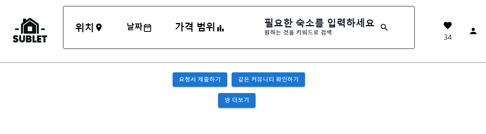
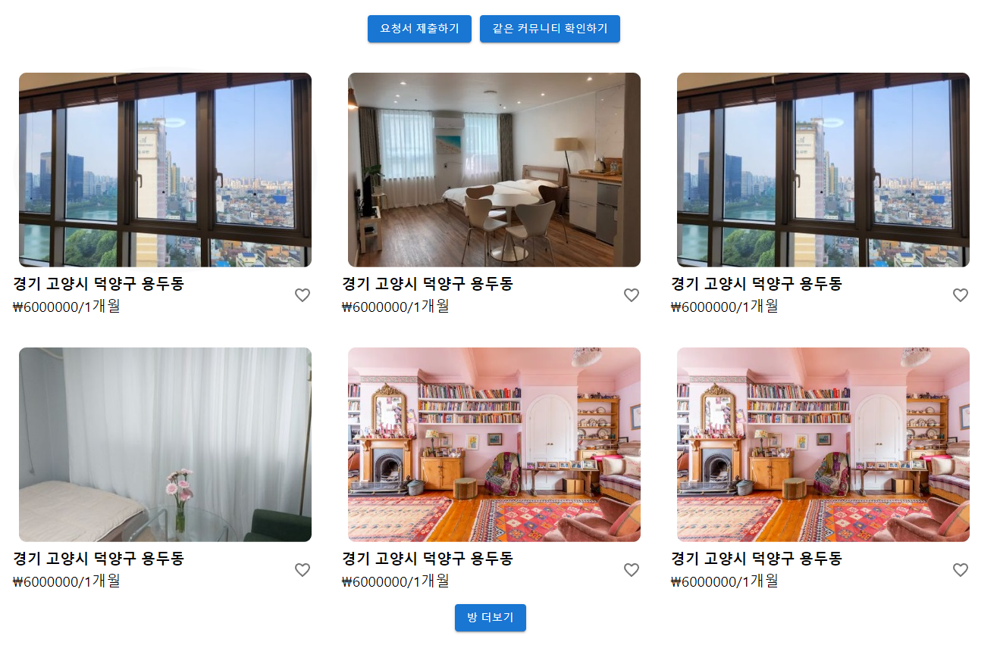
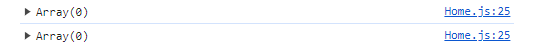
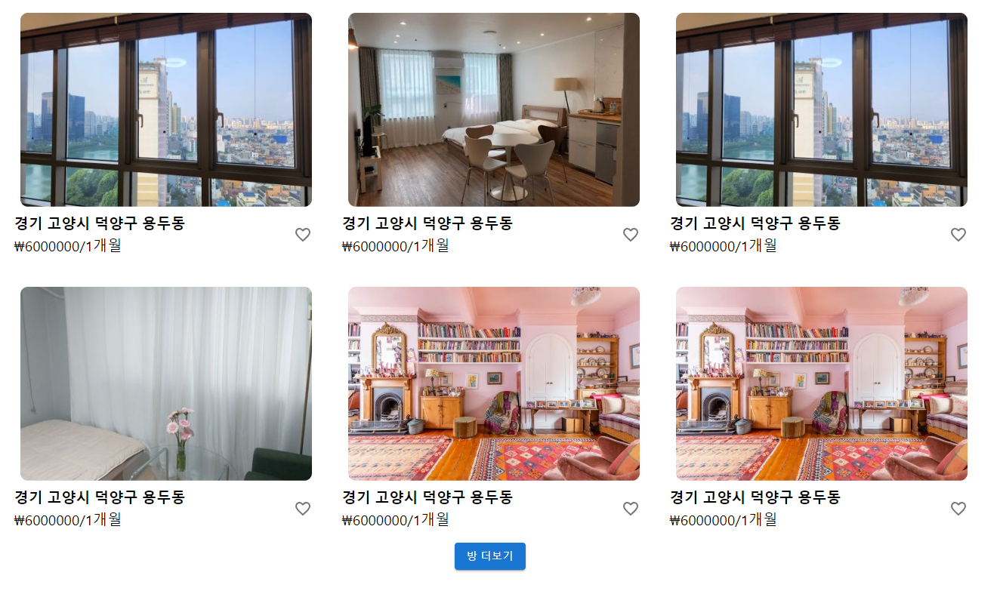

최근 참여하고 있는 프로젝트에서 React로 방 정보를 불러와서 뛰어주는 메인 페이지를 만들어야 하는 일이 있다.
백엔드 만들어주시는 분이 api 방식으로 간단하게 방 정보들 가져올 수 있도록 해주셔서 그걸 적극 활용하였다.
생각나는대로 api가 가져오는 정보를 기존 방 정보랑 결합해주도록 하는 더보기 버튼을 만드니, 계속해서 방 리스트를 가져올 수가 있었다.
그리고 현재 띄어주는 것과 별개로 미리 다음 방 정보를 가져오는 것이 좋겠다고 같이 모각코를 진행중인 분이 말해주었었는데, 확실히 그렇게하니 더 불러올 방이 있으면 버튼이 활성화되고 없으면 비활성화 되는 기능을 구현하기 쉬웠다.

일단 이런 식으로 생각나는 대로 기능을 구현했더니, 그대로 바로 동작했다.
그래서 바로 commit 하고 GitHub로 push하였으나.. 여기서 문제가 발생했다.


그냥 이렇게 떠버리는 것이 아닌가?


버튼을 한번 눌러주어야 내가 기대한 최초의 화면이 나와버린다
최초 실행 시에도 방 정보를 받아와야 하는데, 버튼을 눌러야 방 정보가 나오는 불친절한 사이트가 되어버린 것이다!

문제의 코드는 바로 이랬다.

```js
useEffect(() => {
  fetchRooms(listRoomAmount, listPageAmount);
}, []);
```

fetch해서 받아온 데이터가 채워져있을 변수를 console.log로 찍어봤더니, 아무것도 없었다.
분명 최초 실행 시에도 방 정보를 받아와야 하는데, 받아오지 못하는 것이다.


그래서 일단 머리를 스친 것은, useEffect가 제때 정보를 못 받아 온 것을 그냥 무시해버리고 있다는 느낌이었다.
과거 react-native 웹뷰 관련 프로젝트를 할 때, gps 정보를 가져온 후에 웹페이지에 있는 js코드를 실행해야 했는데, 이 개념을 잘 몰라서 많이 헤맨적이 있었다.
또한 저번 학기 운영체제 시간에 언급했던 프로젝트 때문에 관심을 가지게 된 동기, 비동기와 관련된 문제인 것 같아 어떻게 검색해서 정보를 알아볼 지 감이 잡혔다.
동기화는 아예 작업을 순차적으로 해버리기 때문에 블록킹 방식과 같다 볼 수 있고, 논블록킹 방식은 작업이 끝날 때까지 기다리지 않는다고 들었었다.
그러면 지금 useEffect는 논블로킹으로 작동 하고있는 것인가? 그래서 바로 구글에 리액트 useEffect 동기화라는 키워드로 검색해보았다.
근데 검색해보니 async, 비동기를 사용하라고 한다.
생각해보면 지금 방 정보를 얻어오는 api에다가 fetch 함수로 데이터를 가져오고 있는데, 당연히 동기나 비동기로 가져와야 했다.
근데 동기화를 하기엔 데이터 받아올 때까지 사용자의 웹페이지가 멈춰있을 수는 없지 않은가?
그래서 비동기로 동작하는 것이 당연한 것이 아닌가 나름대로 생각하며 바로 useEffect에서 async를 사용해버렸다.

```js
useEffect(() => {
  async function fetchData() {
    const res = await fetch(
      process.env.REACT_APP_BACKEND_URL +
        "/post" +
        `?maxPost=${listRoomAmount}&page=${listPageAmount}`
    );
    const data = await res.json();
    setPreRoomsData(data);
    setRoomsData([...roomsData, ...data]);
  }
  fetchData();
}, []);
```



그러니 잘 동작한다.
