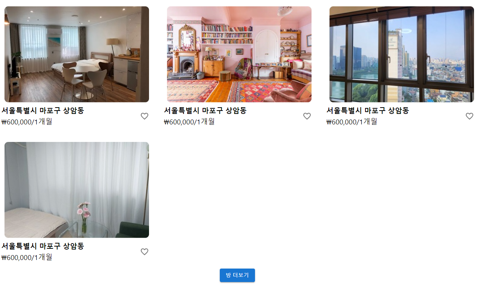
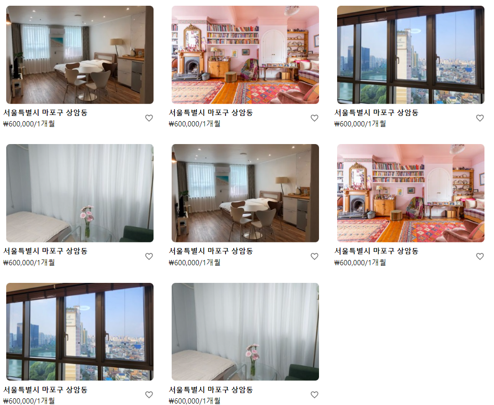
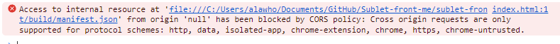

글 게시물이 나오도록 코드를 짠 부분에서, 게시물이 중복되어서 나온다는 현상이 발생되었다.

글 게시물을 여러개 나오도록 하는 것에 초점을 맞춰 만들어서, 중복되는지 몰랐는데 운 좋게 팀원이 발견해주었다.

현재 db 상에 방 게시물 데이터가 4개 밖에 안 올렸는데, 아래에 방 더보기 버튼이 생겨서 눌러보았더니,

이렇게 똑같은 방이 또 떠버린다.
왜 그런 것인가?

처음에 방 정보가 없을 때에도 방을 불러올 수 있도록 useEffect에서 방 정보를 가져오는 코드를 넣어놓았었다.
그래서 데이터를 살펴보기 위해 useEffect 안에 console.log 로 찍어보니, console.log 여러번 수행이 되는 것을 확인할 수 있었다.

뭔가 이상한 듯 하여 인터넷에 "리액트 useEffect 2번 돌아감" 이런 느낌으로 검색해보니 strict 모드를 했을 때, 리액트 개발 모드로 돌려서 보면 useEffect가 여러번 호출된다는 것이다.

그래서 `npm start`가 아닌, `npm run build`로 돌린 후 index.html로 확인해보았다.

근데 아무 화면도 안 떠서 왜 그런가 확인해보았더니, npm run build는 서버에 올라가는 것을 가정하여 "/"를 경로로 하기 때문이라고 그런다. [(참고 글)](https://nuucolog.tistory.com/26)
그래서 [다른 글](https://stackoverflow.com/questions/43011207/using-homepage-in-package-json-without-messing-up-paths-for-localhost)과 [문서](https://create-react-app.dev/docs/deployment/)도 한번 슬쩍 보면서 상대 경로인 "."로 바꿔주었다.

그런데도 안된다.
그래서 콘솔창을 열어보니 다음과 같은 것이 뜨는데..

해결책을 찾고 다음 포스트에 이어서 하겠다.
