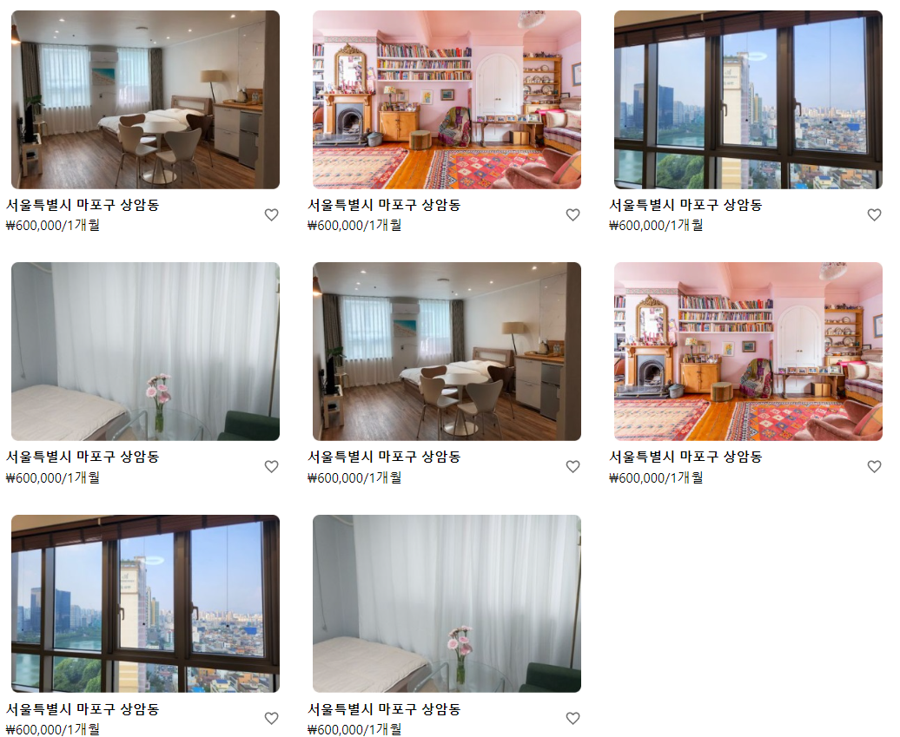
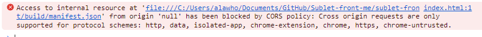

저번에 위 사진과 같이 방이 중복되어서 나오는 문제가 있었다.
그래서 useEffect가 strict 모드에서 두번 렌더링 한다는 것을 의심했었고, 프로덕트로 빌드하고 크롬으로 파일을 직접 열어보았더니 아래와 같은 오류가 나왔었다.



그래서 검색해보니 해당 프로덕트용 코드를 서버 프로그램으로 올려주면, 접속이 된다 하였다.

```bash
npm install -g serve
serve -s build
```

그래서 뭔가 이런 식으로 했더니 프로덕트용 코드를 열 수 있었다.
하지만 여전히 방이 중복되어서 나오는 것이 아닌가?

그래서 코드의 로직을 약간 바꿨다.
방 더 불러오기 버튼을 눌렀을 때 이미 사전에 불러와져있던 방 정보를 화면에 표시하고, 동시에 그 다음 방 정보들을 사전에 저장시켜놓는데.
이 방 더 불러오기 로직을 그대로 웹페이지가 시작될 때 방 불러오는 용도로 두번 정도 사용해버리니, 뭔가 문제가 있었나 싶다.
그래서 아예 개별적으로 방 정보만 불러오고, 그 다음 방 정보를 저장하도록 분리했더니 방 중복 없이 정상 작동하였다.
